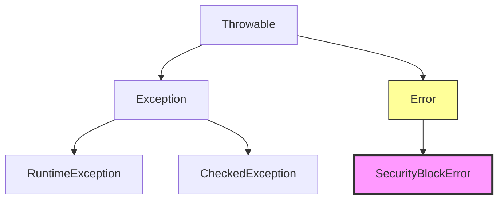
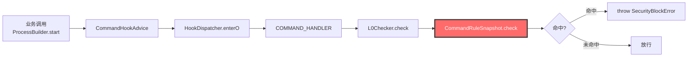
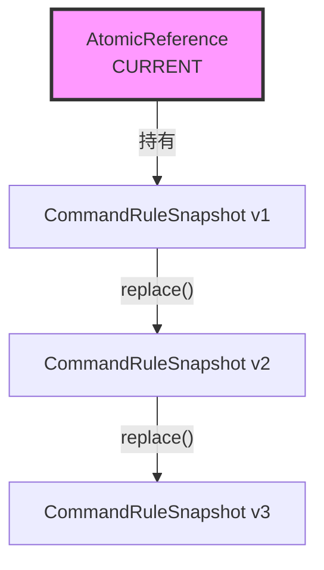
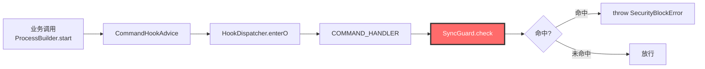
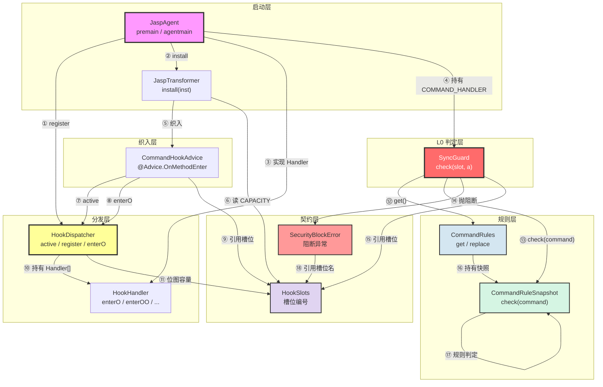
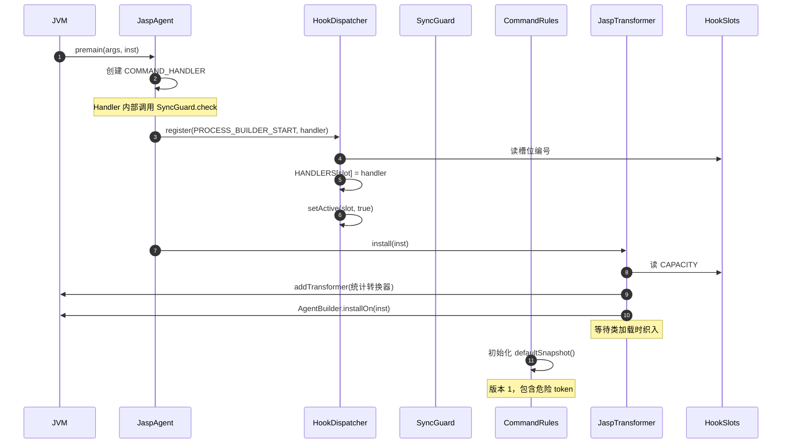
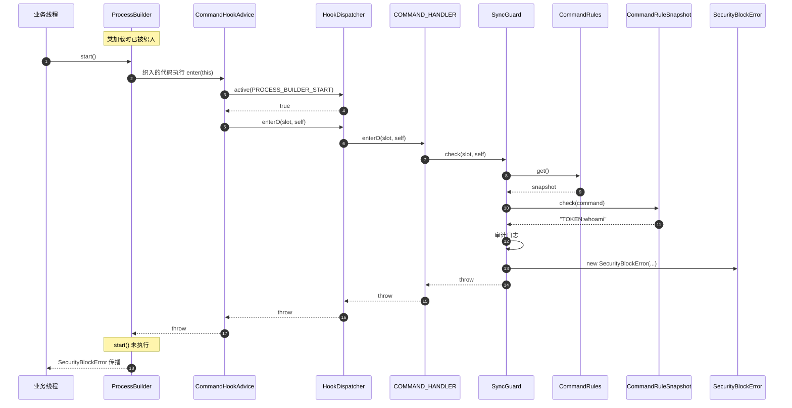
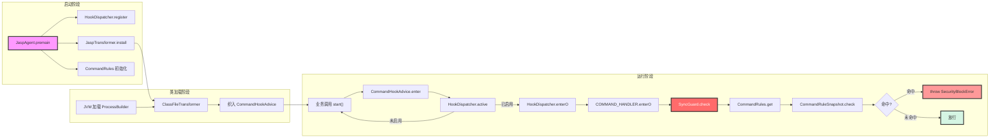

# RASP(2)——实现基本拦截

## 前言

在文章[RASP开发(1)——第一个跑通的 Java Agent | Solowalker](https://s0lowalker.github.io/docs/rasp/rasp开发1第一个跑通的javaagent/)中我们实现了第一个能够跑通的 Java Agent，但是只能看到命令是不是执行了，并无法进行拦截，所以这一章将记载我实现的第一个命令执行的拦截功能。

## 阻断异常

为了拦截危险调用，我们需要设计一个唯一阻断异常类型，它的设计目标是**既能让业务线程在危险调用处被立即终止，又能携带完整的决策上下文以供审计追溯。**而这个异常类型的唯一职责就是：把**拦截住了**这件事，从 RASP 内部传到业务代码中，也就是是当 RASP 判定这次调用是攻击之后怎么让业务线程停下来。

而拦截这个动作，在 Java 中唯一的表达方式就是**抛异常**。

但是我们抛异常不能继承`Exception`而是要继承`Error`，这是整个阻断异常最关键的设计决策。



我们使用`Error`来进行阻断，是因为在大部分业务代码中是使用`Exception`来吞掉异常的，如果我们继承`Exception`就会让阻断信号被业务代码吞掉，所以我们必须想办法来穿透业务。但是在框架中一般会抛出`Throwable`，这个问题后续再进行解决。

### 为什么必须是一个专门的类

我们不能随便抛一个异常`RuntimeException("blocked")`就完事，因为在之前写的`HookDispatcher`必须能够区分两种情况：

1. 阻断信号，这个是必须穿透的。
2. RASP 自身出错了，这个是必须吞掉的。

如果两者都是`RuntimeException`，就可能造成两种后果，一种是所有异常全部吞掉，这就会导致危险调用命中规则但是放行了；另一种是全部穿透到业务代码中，这就会导致任何一个 RASP 的小 bug 都可能会变成业务故障，这和 RASP 的设计原则相违背。

### 保存什么东西

既然这个异常是用来拦截的，其中就要保存一些这个异常有什么特点，比如是哪个槽位拦截的、命中了哪条规则以及规则快照版本。

- slot：哪个槽位拦截的。用途：
  - 告诉审计层“是哪个 Hook 点拦截的”
  - 进入决策记录
  - 便于定位是哪个检测器的判断
- ruleId：命中哪条规则。用途：
  - 告诉审计层“具体是哪条规则触发的”
  - 规则命中分布统计
  - 规则调优依据
- ruleVersion：规则快照版本。用途：
  - 在目前已经设计好的架构文档中要求：**决策区必须携带规则版本**
  - 决策可追溯——事后能知道“这次拦截是在哪个规则版本下做出的”
  - 回放能力——可以用同一版本的规则复现决策
- serialVersionUID：这是 Java 序列化机制要求的字段。`Error`实现了`Serializable`接口，如果需要跨 JVM 传输就需要这个字段。

### 项目源码

```java
package com.jasp.agent;

/**
 * 唯一的阻断异常类型
 */

public final class SecurityBlockError extends Error{

    private static final long serialVersionUID = 1L;

    private final int slot;            //哪个槽位拦的
    private final String ruleId;       //命中哪条规则
    private final long ruleVersion;    //规则快照版本 ———— 决策记录使用

    public SecurityBlockError(int slot, String ruleId, long ruleVersion, String message) {
        super(message);
        this.slot = slot;
        this.ruleId = ruleId;
        this.ruleVersion = ruleVersion;
    }

    public int slot(){
        return slot;
    }

    public String ruleId(){
        return ruleId;
    }

    public long ruleVersion(){
        return ruleVersion;
    }

    @Override
    public String toString() {
        return "SecurityBlockError{slot=" + slot + "(" + HookSlots.name(slot) + ")"
                + ", ruleId=" + ruleId
                + ", ruleVersion=" + ruleVersion
                + ", message=" + getMessage() + "}";
    }
}
```

## 规则快照

先说说什么是快照。

快照是某一时刻的规则状态，创建后不可变，就像我们的虚拟机就有快照，当我们在虚拟机里测试一些病毒就会在测试之前先设置一个快照以便测试完之后恢复虚拟机状态。

快照意味着：

| 特性         | 说明                           |
| :----------- | :----------------------------- |
| **不可变**   | 创建后不能修改                 |
| **某一时刻** | 代表某一时刻的规则状态         |
| **可替换**   | 热更新时用新快照替换旧快照     |
| **原子性**   | 替换是原子的，不会出现“半更新” |

那么为什么我们使用快照而不是可变规则表？

```java
// ❌ 可变规则表
public class CommandRules {
    private Set<String> dangerousTokens = new HashSet<>();
    
    public void addToken(String token) {
        dangerousTokens.add(token);  // 运行期修改
    }
    
    public boolean isDangerous(String token) {
        return dangerousTokens.contains(token);  // 读的时候可能正在被改
    }
}

// 问题：
//   ① 多线程读写需要加锁
//   ② 可能读到"改了一半"的状态
//   ③ 热更新时无法原子替换
```

```java
// ✅ 不可变快照
public final class CommandRuleSnapshot {
    private final Set<String> dangerousTokens;  // final，不可变
    
    public boolean isDangerous(String token) {
        return dangerousTokens.contains(token);  // 读不需要加锁
    }
}

// 热更新：
AtomicReference<CommandRuleSnapshot> SNAPSHOT = new AtomicReference<>(EMPTY);
SNAPSHOT.set(newSnapshot);  // 原子替换，读者要么看到旧版，要么看到新版
```

**快照的三个好处：**

| 好处             | 说明                                    |
| :--------------- | :-------------------------------------- |
| **线程安全**     | 不可变对象，多线程读不需要加锁          |
| **原子替换**     | 一个 `AtomicReference.set()` 完成热更新 |
| **无半更新状态** | 读者不会看到“改了一半”的规则            |

### 第一个规则快照——命令执行规则快照

这个快照的作用就是把“什么命令应该被拦”从代码中搬出来，变成一份不可变的数据，同时是 L0 同步判定的**规则载体**，在微秒级内判断一个命令是否危险。

我们看一下这个规则快照在整个链路中处于什么位置：



这是 L0 判定的规则表，所有的危险命令、危险 token、白名单都在这里。

#### 字段

```java
private final long version;                    // 规则版本
private final Set<List<String>> exactCommands; // 完整命令序列黑名单
private final Set<String> dangerousTokens;     // 危险 token 黑名单
private final int maxArgLength;                // 参数长度上限
private final Set<String> whitelist;           // 白名单
```

| 字段              | 类型                | 用途                   |
| :---------------- | :------------------ | :--------------------- |
| `version`         | `long`              | 规则版本，进入决策记录 |
| `exactCommands`   | `Set<List<String>>` | 完整命令序列精确匹配   |
| `dangerousTokens` | `Set<String>`       | 单个 token 匹配        |
| `maxArgLength`    | `int`               | 超长参数判可疑         |
| `whitelist`       | `Set<String>`       | 一票否决               |

同时还内置了一个空快照，用来初始化状态或者临时关闭检测：

```java
/** 空快照：什么都不拦截，用于初始状态或者关闭检测 */
public static final CommandRuleSnapshot EMPTY = new CommandRuleSnapshot(
        0,
        Collections.<List<String>>emptyList(),
        Collections.<String>emptySet(),
        Integer.MAX_VALUE,
        Collections.<String>emptySet());
```

#### 构造方法

```java
public CommandRuleSnapshot(long version,
                           List<List<String>> exactCommands,
                           Set<String> dangerousTokens,
                           int maxArgLength,
                           Set<String> whitelist) {
    if (version < 0) {
        throw new IllegalArgumentException("version < 0: " + version);
    }
    if (maxArgLength <= 0) {
        throw new IllegalArgumentException("maxArgLength <= 0: " + maxArgLength);
    }
    this.version = version;

    // 防御性拷贝 + 不可变包装 —— 保证快照真的不可变
    // （否则调用方留着原集合的引用，改一改就把"不可变快照"改了）
    Set<List<String>> seqs = new HashSet<List<String>>();
    if (exactCommands != null) {
        for (List<String> seq : exactCommands) {
            if (seq == null || seq.isEmpty()) {
                continue;
            }
            seqs.add(Collections.unmodifiableList(new ArrayList<String>(seq)));
        }
    }
    this.exactCommands = Collections.unmodifiableSet(seqs);
    this.dangerousTokens = immutable(dangerousTokens);
    this.maxArgLength = maxArgLength;
    this.whitelist = immutable(whitelist);
}
```

为了保证这个快照是真正不可变的，这里使用了防御性拷贝加不可变包装来实现，即在构造方法中把外部传入的可变对象进行一次复制，同时进行一个只读的包装。

#### immutable()

```java
private static Set<String> immutable(Set<String> src) {
    if (src == null || src.isEmpty()) {
        return Collections.emptySet();
    }
    return Collections.unmodifiableSet(new HashSet<String>(src));
}
```

这个是一个辅助方法，也是用来实现防御性拷贝加不可变包装的。

#### ckeck()

这个方法就是这个类的核心。

```java
public String check(List<String> command) {
    if (command == null || command.isEmpty()) {
        return null;
    }

    // 白名单一票否决（必须最先判）
    if (!whitelist.isEmpty()) {
        for (int i = 0; i < command.size(); i++) {
            if (whitelist.contains(command.get(i))) {
                return RULE_WHITELISTED;
            }
        }
    }

    // 完整命令序列精确匹配（List.equals，零分配）
    if (!exactCommands.isEmpty() && exactCommands.contains(command)) {
        return "EXACT";
    }

    // 任一 token 命中危险集合
    if (!dangerousTokens.isEmpty()) {
        for (int i = 0; i < command.size(); i++) {
            String token = command.get(i);
            if (dangerousTokens.contains(token)) {
                return "TOKEN:" + token;
            }
        }
    }

    // 超长参数 → 判可疑（异常输入前置拦截）
    for (int i = 0; i < command.size(); i++) {
        if (command.get(i).length() > maxArgLength) {
            return "OVERLONG";
        }
    }

    return null;
}
```

这里就是判断整个命令是不是危险的。首先肯定是先进行一次白名单的过滤，然后根据我们设定的其他规则进行判定。

## 管理快照

有了规则快照之后，我们就要想怎么使用这个规则快照，以及后续规则进行更新的时候应该怎么管理。这就是快照持有者的作用。

持有者是快照的“加载”，它负责让**换规则**这件事原子、可校验、可追溯。它本身不判定任何东西，只做两件事：**读**和**换**。

就看看我目前项目中的类：

| 类                    | 角色                         |
| :-------------------- | :--------------------------- |
| `CommandRules`        | 持有当前快照，提供读写入口   |
| `CommandRuleSnapshot` | 快照本身，包含规则和判定逻辑 |

```java
package com.jasp.agent;

import java.util.*;
import java.util.concurrent.atomic.AtomicReference;

/**
 * 规则快照的持有者 —— 读侧无锁、写侧原子替换
 * */

public final class CommandRules {

    private CommandRules() {
    }

    private static final AtomicReference<CommandRuleSnapshot> CURRENT =
            new AtomicReference<CommandRuleSnapshot>(defaultSnapshot());

    /** 读侧：一次 volatile 读，无锁。会被 L0 判定在 hot path 上调用。 */
    public static CommandRuleSnapshot get() {
        return CURRENT.get();
    }

    /**
     * 原子替换规则快照。
     *
     * 校验失败会抛 IllegalArgumentException —— 全有或全无：
     * 要么换成功，要么保持原样，不会出现"换到一半"。
     *
     * 为什么要求版本单调递增：
     *   防回滚 / 防乱序（比如两个控制面推送乱序到达，
     *   或者有人拿旧快照来"回滚"却不知道那已经是旧的了）。
     *
     * @return 被替换掉的旧快照（便于排障/回滚记录）
     */
    public static CommandRuleSnapshot replace(CommandRuleSnapshot next) {
        if (next == null) {
            throw new IllegalArgumentException("snapshot == null");
        }
        CommandRuleSnapshot old;
        do {
            old = CURRENT.get();
            if (next.version() <= old.version()) {
                throw new IllegalArgumentException(
                        "version must be monotonically increasing: next=" + next.version()
                                + " <= current=" + old.version());
            }
        } while (!CURRENT.compareAndSet(old, next));
        return old;
    }

    /**
     * 内置的默认规则 —— 演示级，不是产品级。
     *
     * 只拦几个明确的侦察/滥用命令
     */
    public static CommandRuleSnapshot defaultSnapshot() {
        Set<String> tokens = new HashSet<String>(Arrays.asList(
                // Windows 常见侦察 / 滥用
                "whoami", "certutil", "bitsadmin", "powershell", "netstat",
                // *nix 常见
                "/bin/sh", "/bin/bash", "chmod", "chown", "useradd", "nc", "ncat"
        ));

        // 精确匹配的整条命令序列
        List<List<String>> exact = new ArrayList<List<String>>();

        // 白名单
        Set<String> whitelist = new HashSet<String>();

        return new CommandRuleSnapshot(1L, exact, tokens, 4096, whitelist);
    }

}
```

核心字段：`AtomicReference`。作用：



这是**规则快照的容器**，支持原子替换。

### 方法

#### replace()

```java
public static CommandRuleSnapshot replace(CommandRuleSnapshot next) {
    if (next == null) {
        throw new IllegalArgumentException("snapshot == null");
    }
    CommandRuleSnapshot old;
    do {
        old = CURRENT.get();
        if (next.version() <= old.version()) {
            throw new IllegalArgumentException(
                    "version must be monotonically increasing: next=" + next.version()
                            + " <= current=" + old.version());
        }
    } while (!CURRENT.compareAndSet(old, next));
    return old;
}
```

**为什么用 CAS 循环而不是 `set()`：**

```text
如果用 CURRENT.set(next)：
  → 不检查当前值
  → 可能覆盖别人的更新
  → 无法做版本校验

用 CAS：
  → 检查当前值是否还是 old
  → 如果是，换成 next
  → 如果不是，说明有人并发替换了，重试
```

**为什么返回旧快照：**

- 便于排障：知道被替换的是什么
- 便于回滚：如果需要，可以用旧快照
- 便于审计：记录“从 v1 换到 v2”的变更历史

#### defaultSnapshot()

```java
public static CommandRuleSnapshot defaultSnapshot() {
    Set<String> tokens = new HashSet<String>(Arrays.asList(
            // Windows 常见侦察 / 滥用
            "whoami", "certutil", "bitsadmin", "powershell", "netstat",
            // *nix 常见
            "/bin/sh", "/bin/bash", "chmod", "chown", "useradd", "nc", "ncat"
    ));

    List<List<String>> exact = new ArrayList<List<String>>();
    Set<String> whitelist = new HashSet<String>();

    return new CommandRuleSnapshot(1L, exact, tokens, 4096, whitelist);
}
```

| 行                                                           | 含义                      |
| :----------------------------------------------------------- | :------------------------ |
| `Set<String> tokens = new HashSet<>(...)`                    | 危险 token 集合           |
| `"whoami", "certutil", ...`                                  | 危险命令列表              |
| `List<List<String>> exact = new ArrayList<>()`               | 精确命令序列（空）        |
| `Set<String> whitelist = new HashSet<>()`                    | 白名单（空）              |
| `return new CommandRuleSnapshot(1L, exact, tokens, 4096, whitelist)` | 版本 1，最大参数长度 4096 |

## L0 同步闸门

闸门，就是拿规则快照来核对危险调用的参数，一旦命中就会抛出`SecurityBlockError`异常。**它是“同步阻断”的执行者。** 没有它，检测只能“事后抛异常”——命令已经跑完了。它是唯一一个知道"怎么判一个 ProcessBuilder"的地方。

在 W2 之后，一次 Hook 触发会经过四个组件：

```text
HookDispatcher  →  编排   先过闸门；没过才交给 Handler            通用，【不认识】具体类型
SyncGuard       →  判定   拿快照核对危险参数，命中就抛           按 slot 分派，【知道】具体类型
CommandRules    →  数据   当前生效的规则是什么                    持有者
Handler         →  执行   未命中时做什么（W2 只是打印）           插件，将来可热替换
```

### 源码

```java
package com.jasp.agent;

import java.util.List;

/**
 * L0 同步闸门 —— 在危险调用发生【之前】判定。
 *
 * 这是核心：没有它，检测只能"事后抛异常"（命令已经跑完了）。
 *
 * 零分配：除了命中时构造 SecurityBlockError，判定路径上不建任何对象。
 */
public final class SyncGuard {

    private SyncGuard() {
    }

    /**
     * 命中则抛 SecurityBlockError；未命中正常返回。
     *
     * 注意：本方法【自己不 catch】—— 异常处理统一放在 HookDispatcher
     * 那一层（那里才能区分"阻断异常要穿透"和"其他异常要吞掉计数"）。
     */
    public static void check(int slot, Object a) {
        switch (slot) {
            case HookSlots.PROCESS_BUILDER_START:
                checkProcessBuilder(a);
                break;
            default:
                // 其他槽位还没有 L0 判定器（W3+ 会加）
                break;
        }
    }

    private static void checkProcessBuilder(Object a) {
        if (!(a instanceof ProcessBuilder)) {
            return;     // 类型不对 → 不判（防御性，正常不会发生）
        }

        CommandRuleSnapshot snapshot = CommandRules.get();       // 一次 volatile 读
        List<String> command = ((ProcessBuilder) a).command();   // 返回内部 List，无分配
        String ruleId = snapshot.check(command);
        if (ruleId == null) {
            return;                                              // MISS → 放行
        }
        if (CommandRuleSnapshot.RULE_WHITELISTED.equals(ruleId)) {
            return;                                              // 白名单一票否决 → 放行
        }

        // 命中 → 审计
        System.err.println("[jasp][BLOCK] slot=" + HookSlots.name(HookSlots.PROCESS_BUILDER_START)
                + " rule=" + ruleId
                + " ruleVersion=" + snapshot.version()
                + " cmd=" + command);

        // 同步阻断
        throw new SecurityBlockError(HookSlots.PROCESS_BUILDER_START, ruleId, snapshot.version(),
                "command blocked by rule " + ruleId);
    }
}
```

看看这个类在整个链路中的位置：



### 方法

#### check()

这个方法负责槽位分发，会根据具体的槽位分发到具体的判定器，然后调用具体的判定，目前只有对于命令执行的槽位，后续会进行补充。

#### checkProcessBuilder()

```java
private static void checkProcessBuilder(Object a) {
    if (!(a instanceof ProcessBuilder)) {
        return;     // 类型不对 → 不判（防御性，正常不会发生）
    }

    CommandRuleSnapshot snapshot = CommandRules.get();       // 一次 volatile 读
    List<String> command = ((ProcessBuilder) a).command();   // 返回内部 List，无分配
    String ruleId = snapshot.check(command);
    if (ruleId == null) {
        return;                                              // MISS → 放行
    }
    if (CommandRuleSnapshot.RULE_WHITELISTED.equals(ruleId)) {
        return;                                              // 白名单一票否决 → 放行
    }

    // 命中 → 审计
    System.err.println("[jasp][BLOCK] slot=" + HookSlots.name(HookSlots.PROCESS_BUILDER_START)
            + " rule=" + ruleId
            + " ruleVersion=" + snapshot.version()
            + " cmd=" + command);

    // 同步阻断
    throw new SecurityBlockError(HookSlots.PROCESS_BUILDER_START, ruleId, snapshot.version(),
            "command blocked by rule " + ruleId);
}
```

但是这里的`System.err.println`是违反了在设计好的架构文档中的“**同步路径禁止 IO**”，这里我就直接让 ai 进行修改了。

> **`SyncGuard` 是 L0 同步闸门——在危险调用发生之前做判定，命中就同步阻断。它的 `check()` 按槽位分发，`checkProcessBuilder()` 是 P2 阶段唯一的判定器。流程是：类型校验 → 读快照 → 取命令 → 判定 → 命中则审计 + 抛 `SecurityBlockError`。它自己不 catch 异常，因为异常处理统一放在 `HookDispatcher` 那一层（那里才能区分“阻断异常要穿透”和“其他异常要吞掉计数”）。未命中路径零分配，命中路径有审计日志和异常构造的分配。**

## 总结

目前项目所有文件之间的依赖图：



启动阶段时序图：



运行阶段时序图：



完整数据流图：



文件职责矩阵：

| 文件                    | 角色         | 依赖                                                         | 被谁依赖                      |
| :---------------------- | :----------- | :----------------------------------------------------------- | :---------------------------- |
| **JaspAgent**           | 启动入口     | HookDispatcher / JaspTransformer / HookHandler / SyncGuard   | JVM                           |
| **JaspTransformer**     | 字节码转换   | CommandHookAdvice / HookSlots                                | JaspAgent                     |
| **CommandHookAdvice**   | 织入逻辑     | HookDispatcher / HookSlots                                   | JaspTransformer（织入）       |
| **HookDispatcher**      | 分发中心     | HookHandler / HookSlots                                      | CommandHookAdvice / JaspAgent |
| **HookHandler**         | 处理逻辑抽象 | 无                                                           | HookDispatcher / JaspAgent    |
| **SyncGuard**           | L0 同步闸门  | CommandRules / CommandRuleSnapshot / SecurityBlockError / HookSlots | COMMAND_HANDLER               |
| **CommandRules**        | 规则持有者   | CommandRuleSnapshot                                          | SyncGuard                     |
| **CommandRuleSnapshot** | 规则快照     | 无                                                           | CommandRules / SyncGuard      |
| **SecurityBlockError**  | 阻断异常     | HookSlots                                                    | SyncGuard                     |
| **HookSlots**           | 契约常量     | 无                                                           | 全部                          |


