# RASP开发(1)——第一个跑通的 Java Agent

> 这一系列文章将以我的 Jasp 项目为线索进行撰写，记录我的 RASP 开发实践路径以及学习笔记。

## 前言

### Java Agent

在记录 RASP 开发之前，先讲讲 Java Agent 机制。

Java Agent 是 JVM 提供的一种“寄生”机制，它允许一段代码在 JVM 启动时或运行期挂载上去，修改已加载或将要加载的类的字节码。它是所有 Java RASP、APM、Arthas 这类工具的技术底座。

#### Java Agent 能做什么

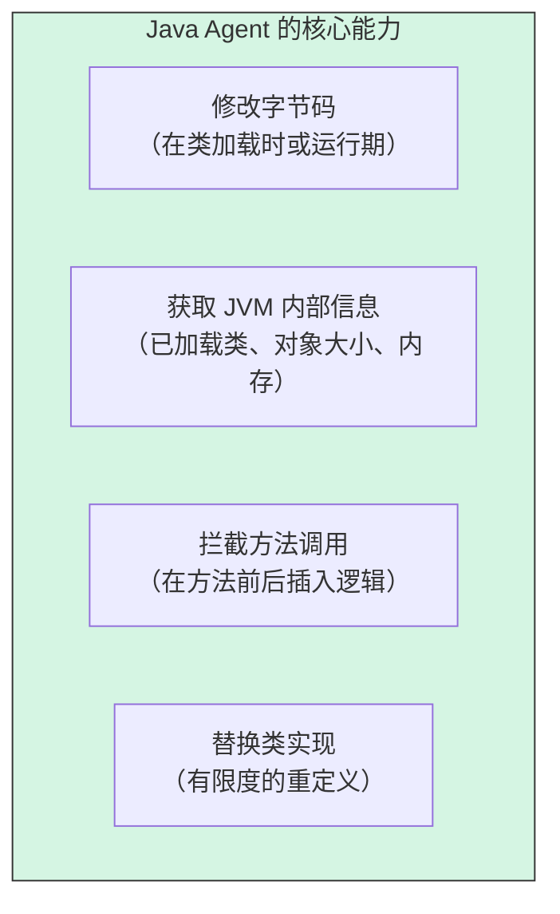

**典型用途：**

| 用途          | 例子                                      |
| :------------ | :---------------------------------------- |
| **RASP**      | 拦截 `ProcessBuilder.start`，检测命令注入 |
| **APM**       | 拦截 `Statement.execute`，统计 SQL 耗时   |
| **调试工具**  | Arthas 动态查看方法调用、参数、返回值     |
| **热部署**    | JRebel 在不重启的情况下加载新代码         |
| **Mock 测试** | 在测试环境替换某些方法的实现              |

#### 两种挂载方式

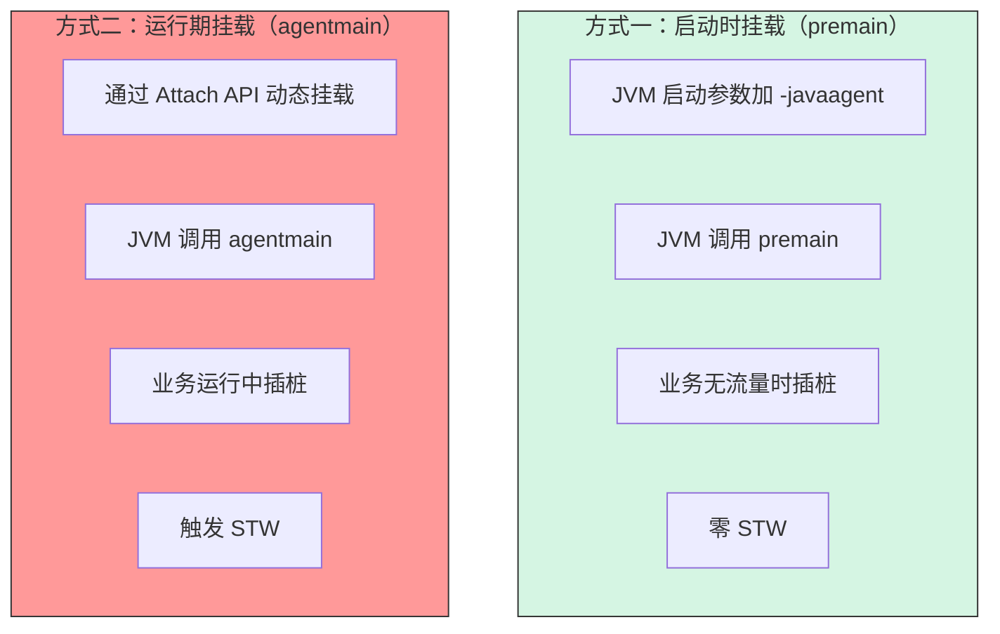

| 维度         | premain              | agentmain                          |
| :----------- | :------------------- | :--------------------------------- |
| 触发方式     | `-javaagent:xxx.jar` | Attach API                         |
| 触发时机     | JVM 启动时           | 运行期任意时刻                     |
| 是否需要重启 | 需要                 | 不需要                             |
| STW 风险     | 零                   | 有（美团实测 TP9999 5ms → 1000ms） |
| 适用场景     | RASP、APM            | Arthas、诊断工具                   |

**RASP 首选 `premain`，因为它在业务无流量时插桩，零 STW。**

> STW 是一种现象，JVM 暂停所有业务线程，做一件必须独占的事，做完才能恢复。这是 RASP 面临的一大挑战，到底是选择用`premain`还是`agentmain`：`premain`是在业务无流量时插桩，即 RASP 和业务代码一起启动；`agentmain`则是在业务代码已经加载，然后进行插桩。前者因为是和业务一起启动的，影响是发生在业务启动之前；后者在业务运行时插桩，肯定会引起所有业务线程停在安全点来运行插桩操作，所以会导致 STW。

#### Java Agent 的核心 API

```java
public class MyAgent {
    
    // 启动时挂载
    public static void premain(String agentArgs, Instrumentation inst) {
        // inst 是核心入口
    }
    
    // 运行期挂载
    public static void agentmain(String agentArgs, Instrumentation inst) {
        // inst 是核心入口
    }
}
```

`Instrumentation`接口提供的能力：

| 方法                                          | 用途                             | STW  |
| :-------------------------------------------- | :------------------------------- | :--- |
| `addTransformer(ClassFileTransformer)`        | 注册字节码转换器                 | 无   |
| `removeTransformer(ClassFileTransformer)`     | 移除转换器                       | 无   |
| `retransformClasses(Class...)`                | 重新转换已加载的类               | 有   |
| `redefineClasses(ClassDefinition...)`         | 重定义类（不能改结构）           | 有   |
| `getAllLoadedClasses()`                       | 获取所有已加载的类               | 无   |
| `getObjectSize(Object)`                       | 获取对象大小                     | 无   |
| `appendToBootstrapClassLoaderSearch(JarFile)` | 把 Jar 加到 BootstrapClassLoader | 无   |

#### 字节码转换的时机

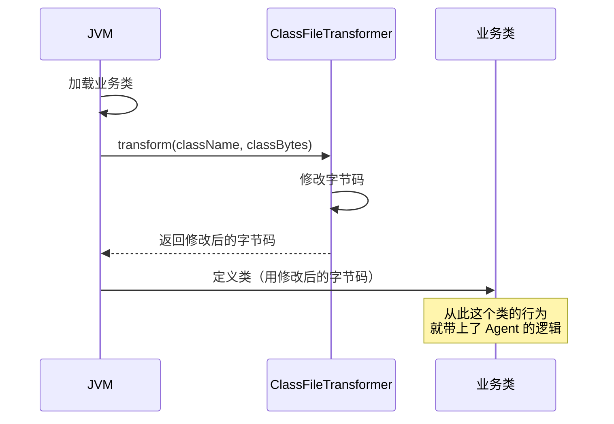

`ClassFileTransformer`在类加载时被调用，可以修改字节码。

```java
public class MyTransformer implements ClassFileTransformer {
    @Override
    public byte[] transform(ClassLoader loader, String className,
                            Class<?> classBeingRedefined,
                            ProtectionDomain protectionDomain,
                            byte[] classfileBuffer) {
        if (!"java/lang/ProcessBuilder".equals(className)) {
            return null;  // 不处理，返回 null
        }
        // 用 ByteBuddy / ASM 修改字节码
        return modifiedBytes;
    }
}
```

#### Java Agent 的物理结构

```text
my-agent.jar
├── META-INF/
│   └── MANIFEST.MF          ← 关键：声明入口类
├── com/example/MyAgent.class
└── ...（其他类和依赖）
```

**`MANIFEST.MF` 必需项：**

```text
Premain-Class: com.example.MyAgent        ← premain 入口
Agent-Class:   com.example.MyAgent        ← agentmain 入口（可选）
Can-Redefine-Classes: true                ← 是否支持重定义
Can-Retransform-Classes: true             ← 是否支持重转换
```

使用方式：

```bash
java -javaagent:/path/to/my-agent.jar=key1=value1 -jar app.jar
```

`key1=value1`会作为`agentArgs`传给`premain`。

#### Java Agent 的物理限制

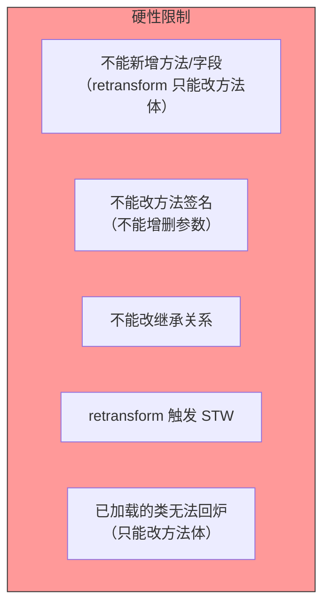

这些限制来自于 JVMTI 规范，所有 Java Agent 都绕不开。

#### Java Agent 的典型架构

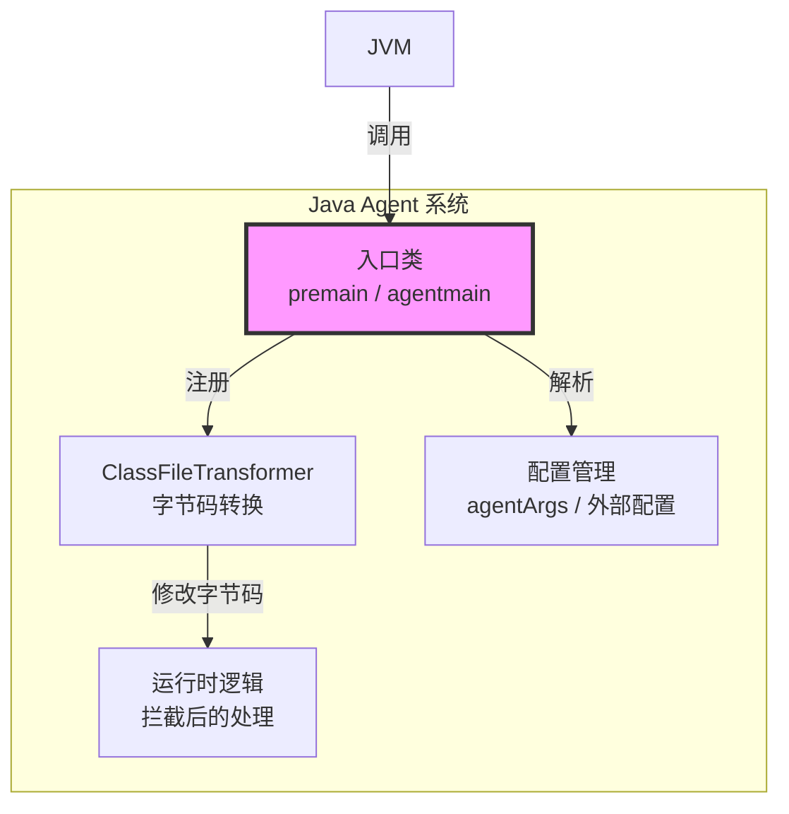

#### Java Agent 的常见坑

| 坑                             | 原因                                  | 解法                                                      |
| :----------------------------- | :------------------------------------ | :-------------------------------------------------------- |
| `premain` 抛异常导致业务起不来 | JVM 直接终止                          | 整体 try/catch，静默降级                                  |
| 类加载器冲突                   | Agent 的依赖和业务冲突                | Shade 重定位                                              |
| `NoClassDefFoundError`         | child-first 类加载器看不到 Agent 的类 | `Boot-Class-Path` 或 `appendToBootstrapClassLoaderSearch` |
| STW 抖动                       | `agentmain` 运行期插桩                | 禁止运行期插桩，只用 `premain`                            |
| 元空间泄漏                     | 插件 ClassLoader 无法卸载             | 代际模型 + 引用清零                                       |
| 递归插桩                       | 插桩逻辑里的日志被插桩                | 黑名单排除日志框架                                        |

## JVM 入口

JVM 入口也就是我们整个 Java Agent 的入口，必须包含至少一个方法：`premain`或`agentmain`。考虑到不影响实际业务，后续的逻辑都以`premain`为主，`premain`完成全部转换，`agentmain`只开开关。

```java
package com.jasp.agent;

import java.lang.instrument.Instrumentation;

public final class JaspAgent {
    private JaspAgent() {
    }

    public static void premain(String agentArgs, Instrumentation inst) {
        long t0 = System.nanoTime();
        try {
            System.err.println("[jasp] agent installed (premain v0.1, no transformer yet)");
        } catch (Throwable t) {
            System.err.println("[jasp] agent install FAILED: " + t);
            t.printStackTrace(System.err);
        } finally {
            System.err.println("[jasp] premain cost = " + ((System.nanoTime() - t0) / 1000L) + " us");
        }
    }

    public static void agentmain(String agentArgs, Instrumentation inst) {
        System.err.println("[jasp] agentmain called - ignored (this architecture freezes the instrumentation set at startup)");
    }
}
```

最关键的就是`try-catch`这一段，一旦`premain`抛异常，JVM 直接启动失败，导致业务跑不起来。使用`Throwable`而不是`Exception`，是因为可能会抛出`Error`，如果抛出`Error`会直接影响 JVM ，**导致业务 JVM 启动失败**。

同时 RASP 的日志一般会输出到`stderr`里来，这样就不影响业务的`stdout`，对于正式产品会写到本地文件中。

## Hook

### Hook 处理逻辑

一个完整的 Hook 由三部分组成：

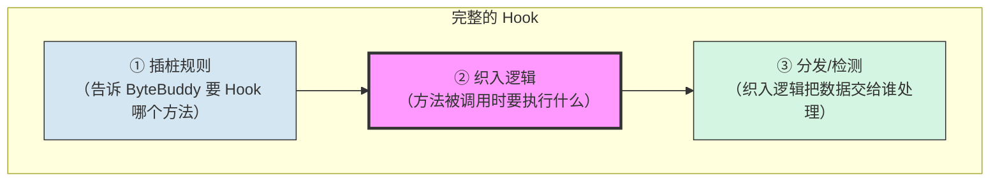

```java
package com.jasp.agent;

import net.bytebuddy.asm.Advice;

import java.util.List;

public final class CommandHookAdvice {
    private CommandHookAdvice() {
    }

    /**
     * 这段代码会被复制到 java.lang.ProcessBuilder#start() 的方法体开头
     *
     * 约束：
     *  不能抛异常
     *  不能做 IO/加锁
     *  尽量不分配对象
     */
    @Advice.OnMethodEnter
    public static void enter(@Advice.This Object self){
        try {
            List<String> command = ((ProcessBuilder) self).command();
            System.err.println("[jasp][hook] ProcessBuilder.start ->"+command);
        } catch (Throwable e) {

        }
    }
}
```

这个就是我们的织入逻辑。

这个类并不是普通的业务类，它永远不会被我们自己调用。`ByteBuddy`在启动时会把这个方法体逐条指令复制到`ProcessBuilder.start`中。

比如说：

```java
//织入前：
public Process start() throws IOException {
	// 原始代码
	...
}

//织入后：
public Process start() throws IOException {
    List<String> command = ((ProcessBuilder) self).command();
    System.err.println("[jasp][hook] ProcessBuilder.start ->"+command);
	// 原始代码
	...
}
```

这个类定义织入什么代码，而`JaspTransformer`这个类决定要不要织、织入哪个方法。通过把选择器和内容分开，能够实现一个 selector 可以配不同的 advice。

下面简单讲讲里面的代码。

`@Advice.OnMethodEnter`这个注解是告诉`ByteBuddy`插在方法体的开头，对应还有`@Advice.OnMethodExit`插在返回前。对于`ByteBuddy`的`Advice`机制来说有一条硬性要求：用`Advice`注解的方法，必须是`static`的。因为`@Advice`的代码是内联的，而不是调用。

`@Advice.This`的作用是把目标方法的`this`注入进来，从而代替`Advice`方法的`this`。

还有一些其他的`@Advice`注解：

| 注解                 | 拿到什么             | 备注                 |
| -------------------- | -------------------- | -------------------- |
| @Advice.This         | this 对象            | 静态方法中用不了     |
| @Advice.Argument(0)  | 第0个参数            | 不发散、不分配       |
| @Advice.AllArguments | 所有参数             | 会分配数组，一般不用 |
| @Advice.Origin       | 被织入方法的签名信息 | 常用于日志           |
| @Advice.Return       | 返回值               | 读返回值的时候用这个 |
| @Advice.Thrown       | 抛出的异常           | -                    |

### Hook 插桩实现

要实现插桩需要四样东西：一个入口、一个转换器、一套匹配规则、一段织入逻辑。

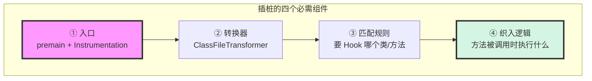

| #    | 组件     | 对应代码                                                     | 职责                                 |
| :--- | :------- | :----------------------------------------------------------- | :----------------------------------- |
| ①    | 入口     | `JaspAgent.premain`                                          | JVM 调用的点，拿到 `Instrumentation` |
| ②    | 转换器   | `JaspTransformer.install`                                    | 注册到 `Instrumentation`，拦截类加载 |
| ③    | 匹配规则 | `.type(named("java.lang.ProcessBuilder"))` + `.on(named("start"))` | 决定 Hook 谁                         |
| ④    | 织入逻辑 | `CommandHookAdvice.enter`                                    | 方法被调用时执行什么                 |

我这个项目中这第一个插桩实现的职责是**统计类加载情况+给`ProcessBuilder.start`织入 Hook**。

```java
package com.jasp.agent;

import net.bytebuddy.agent.builder.AgentBuilder;
import net.bytebuddy.asm.Advice;
import net.bytebuddy.matcher.ElementMatchers;

import java.lang.instrument.ClassFileTransformer;
import java.lang.instrument.Instrumentation;
import java.security.ProtectionDomain;
import java.util.concurrent.atomic.AtomicInteger;

public final class JaspTransformer {
    private JaspTransformer() {
    }

    //JVM给我们的类总数
    private static final AtomicInteger CLASSES_SEEN = new AtomicInteger();
    //实际被织入的类数
    private static final AtomicInteger CLASSES_WOVEN = new AtomicInteger();

    public static void install(Instrumentation inst){
        //统计数量，并不修改类
        inst.addTransformer(new ClassFileTransformer() {
            @Override
            public byte[] transform(ClassLoader loader, String className,
                                    Class<?> classBeingRedefined,
                                    ProtectionDomain protectionDomain,
                                    byte[] classfileBuffer){
                CLASSES_SEEN.incrementAndGet();
                return null;    //不修改这个类
            }
        },false);

        //织入器
        new AgentBuilder.Default()
                .ignore(ElementMatchers.nameStartsWith("net.bytebuddy."))
                .or(ElementMatchers.nameStartsWith("org.objectweb.asm."))
                .or(ElementMatchers.nameStartsWith("com.jasp."))
                .or(ElementMatchers.nameStartsWith("java.lang.reflect."))
                .or(ElementMatchers.nameStartsWith("java.lang.invoke."))
                .or(ElementMatchers.nameStartsWith("sun.reflect."))
                .or(ElementMatchers.named("java.lang.String"))
                .or(ElementMatchers.named("java.lang.StringBuilder"))
                .or(ElementMatchers.named("java.lang.ClassLoader"))
                .or(ElementMatchers.named("java.lang.Thread"))
                .or(ElementMatchers.named("java.lang.System"))
                .or(ElementMatchers.named("java.lang.Throwable"))
                .or(ElementMatchers.isSynthetic())
                .type(ElementMatchers.named("java.lang.ProcessBuilder"))
                .transform((builder, typeDescription, classLoader, module, protectionDomain) -> {
                    CLASSES_WOVEN.incrementAndGet();
                    System.err.println("[jasp] weaving ->"+typeDescription.getName()
                        +"(loader="+classLoader+")");
                    return builder.visit(
                            Advice.to(CommandHookAdvice.class)
                                    .on(ElementMatchers.named("start")));
                }).installOn(inst);

        //退出时打印统计（临时方案）
        Runtime.getRuntime().addShutdownHook(new Thread(new Runnable() {
            @Override
            public void run() {
                System.err.println("[jasp] stats: classes seen = "+CLASSES_SEEN.get()
                    +", woven = "+CLASSES_WOVEN.get());
            }
        },"jasp-stats"));
    }
}
```

#### 整体结构

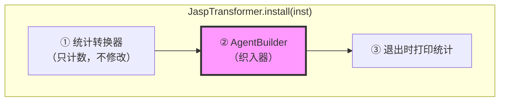

只做三件事：

1. 注册一个只计数的`ClassFileTransformer`——统计 JVM 加载了多少个类
2. 用`AgentBuilder`织入`ProcessBuilder.start`——真正的 Hook
3. 注册 ShutdownHook ——退出时打印统计

#### 统计转换器

```java
inst.addTransformer(new ClassFileTransformer() {
    @Override
    public byte[] transform(ClassLoader loader, String className, ...) {
        CLASSES_SEEN.incrementAndGet();
        return null;  // 不修改
    }
}, false);
```

这个转换器是作用就是每次 JVM 记载一个类，都会调用这个`transform`，它只做计数，返回`null`表示“不修改”。

我们需要这个转换器来实现自检，不仅是为了看 Agent 到底看到了几个类，还是为了自检`Transformer`有没有生效。`flase`这个参数表示`canRetransform = false`，即**“不参与重转换”**，因为它只关心类首次加载，不关心重转换。

#### 织入器

```java
new AgentBuilder.Default()
    .ignore(...)           // 黑名单：不处理这些类
    .type(ElementMatchers.named("java.lang.ProcessBuilder"))  // 目标类
    .transform((builder, ...) -> {
        CLASSES_WOVEN.incrementAndGet();
        return builder.visit(
            Advice.to(CommandHookAdvice.class)
                .on(ElementMatchers.named("start"))
        );
    })
    .installOn(inst);
```

首先是`ignore()`黑名单：

```java
.ignore(ElementMatchers.nameStartsWith("net.bytebuddy."))
.or(ElementMatchers.nameStartsWith("org.objectweb.asm."))
.or(ElementMatchers.nameStartsWith("com.jasp."))
.or(ElementMatchers.nameStartsWith("java.lang.reflect."))
.or(ElementMatchers.nameStartsWith("java.lang.invoke."))
.or(ElementMatchers.nameStartsWith("sun.reflect."))
.or(ElementMatchers.named("java.lang.String"))
.or(ElementMatchers.named("java.lang.StringBuilder"))
.or(ElementMatchers.named("java.lang.ClassLoader"))
.or(ElementMatchers.named("java.lang.Thread"))
.or(ElementMatchers.named("java.lang.System"))
.or(ElementMatchers.named("java.lang.Throwable"))
.or(ElementMatchers.isSynthetic())
```

| 前缀                      | 排除原因                   |
| :------------------------ | :------------------------- |
| `net.bytebuddy.*`         | 禁止自插桩                 |
| `org.objectweb.asm.*`     | 禁止自插桩                 |
| `com.jasp.*`              | 禁止自插桩                 |
| `java.lang.reflect.*`     | 防递归                     |
| `java.lang.invoke.*`      | 防递归                     |
| `sun.reflect.*`           | 防递归                     |
| `java.lang.String`        | 高频类，插桩会严重影响性能 |
| `java.lang.StringBuilder` | 高频类                     |
| `java.lang.ClassLoader`   | 插桩会导致类加载异常       |
| `java.lang.Thread`        | 高频类                     |
| `java.lang.System`        | 高频类                     |
| `java.lang.Throwable`     | 高频类                     |
| `isSynthetic()`           | 编译器生成的合成类         |

非常要注意的一点就是要排除自插桩，因为插桩逻辑本身被插桩会导致三个致命问题：**无限递归、类加载死锁、性能崩溃**。（其实像死锁这一块的内容我还不会，后面学一下 JVM 了解一下锁机制）

这个黑名单目前还不齐全，像**日志框架**和**已知的其他 Agent 包名**都需要排除，后续再补充。

然后是`.type(...)`目标类：

```java
.type(ElementMatchers.named("java.lang.ProcessBuilder"))
```

这里只处理`java.lang.ProcessBuilder`这一个类。

再就是`.transform(...)`织入逻辑：

```java
.transform((builder, typeDescription, classLoader, module, protectionDomain) -> {
    CLASSES_WOVEN.incrementAndGet();
    System.err.println("[jasp] weaving -> " + typeDescription.getName() + "(loader=" + classLoader + ")");
    return builder.visit(
        Advice.to(CommandHookAdvice.class)
            .on(ElementMatchers.named("start"))
    );
})
```

一共做三件事：

1. 计数`CLASSES_WOVEN`
2. 打印日志
3. 把`CommandHookAdvice`织入到`start`方法上

`Advice.to(CommandHookAdvice.class).on(named("start"))`的含义就是：把`CommandHookAdvice`里所有`@Advice.OnMethodEnter / @Advice.OnMethodExit`标注的方法都织入到`ProcessBuilder.start`方法上。

再就是`.installOn`，这个方法负责把配置好的 AgentBuilder 注册到`Instrumentation`上。从此所有类加载都会经过它的匹配逻辑。

#### ShutdownHook

```java
Runtime.getRuntime().addShutdownHook(new Thread(() -> {
    System.err.println("[jasp] stats: classes seen = " + CLASSES_SEEN.get()
        + ", woven = " + CLASSES_WOVEN.get());
}, "jasp-stats"));  //jasp-stats是线程名
```

这里的作用就是当 JVM 退出时打印统计，这其实是一个临时方案，用来验证“Agent 到底看到了多少类、织入了多少类”。

然后在`premain`加上一个`JaspTransformer.install(inst);`就能实现插桩以及织入了。

## 两个不可逆契约

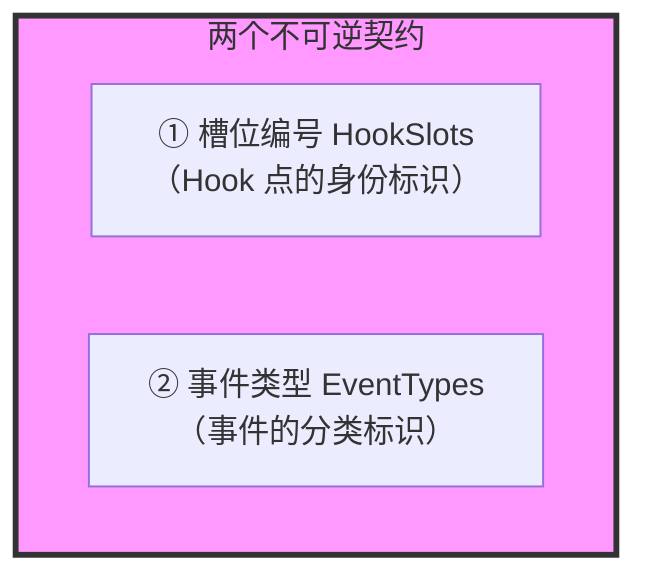

| 契约         | 是什么                   | 谁用                           |
| :----------- | :----------------------- | :----------------------------- |
| **槽位编号** | 每个 Hook 点一个整数编号 | 分发器、位图开关、插件契约     |
| **事件类型** | 每个事件类别一个整数编号 | 事件位图、插件订阅、调度器路由 |

简单来说，我们需要用一个位图来控制“哪些 Hook 生效”。所以我们需要一个`long[]`，而位图则是其中每一位对应的一个 Hook 点，而每一个 Hook 点都需要一个**稳定的整数编号**，这就产生了我们的`hookSlots`类。而位图打开后就要有人来干活，而干活的人需要接收一些参数，这就产生了`HookHandler`这个类。这两个东西一旦发布就不能改，因为它们会同时进入插件的声明、已经被织入业务类字节码的调用形态。

### HookSlots

它会给每个 Hook 点发一个不会变的编号。

```java
package com.jasp.agent;

public final class HookSlots {
    /**
     * Hook 槽位编号
     *
     * 规则：
     *  1.编号一旦发布不得重用（老插件按照编号寻找 Hook 点）
     *  2.容量只能扩大，不能缩小（必须是64的倍数）
     *  3. 新增槽位是向后兼容的
     *
     * 功能：骨架预织入能做到“0 STW地启用/停用 Hook”
     * 代价：织入面和槽位编号在启动时冻结
     */
    private HookSlots() {
    }

    //槽位容量（64的倍数），有128个long
    public static final int CAPACITY = 8192;

    //每个攻击面预留的编号数 段基址=段序号*SEG_SIZE
    public static final int SEG_SIZE = 256;

    //按照攻击面分段，每段预留256个编号
    /** 命令执行：0-255 */
    public static final int SEG_COMMAND = 0 * SEG_SIZE;
    /** 反序列化：256-511 */
    public static final int SEG_DESERIALIZE = 1 * SEG_SIZE ;
    /** SQL注入：512-767 */
    public static final int SEG_SQL = 2 * SEG_SIZE;
    /** 文件操作：768-1023 */
    public static final int SEG_FILE = 3 * SEG_SIZE;
    /** 网络请求/SSRF：1024-1279 */
    public static final int SEG_NETWORK = 4 * SEG_SIZE;
    /** JNDI查询：1280-1535 */
    public static final int SEG_JNDI = 5 * SEG_SIZE;
    /** 反射 / 方法调用：1536 - 1791 */
    public static final int SEG_REFLECT = 6 * SEG_SIZE;
    /** 类加载 / 动态字节码：1792 - 2047 */
    public static final int SEG_CLASSLOAD    = 7 * SEG_SIZE;
    /** 表达式注入（SpEL / OGNL / MVEL）：2048 - 2303 */
    public static final int SEG_EXPRESSION   = 8 * SEG_SIZE;
    /** 脚本引擎：2304 - 2559 */
    public static final int SEG_SCRIPT       = 9 * SEG_SIZE;
    /** 模板注入：2560 - 2815 */
    public static final int SEG_TEMPLATE     = 10 * SEG_SIZE;
    /** XML / XXE：2816 - 3071 */
    public static final int SEG_XML          = 11 * SEG_SIZE;
    /** 文件上传：3072 - 3327 */
    public static final int SEG_UPLOAD       = 12 * SEG_SIZE;
    /** 请求载体 / 上下文（Servlet / RPC / MQ 入口）：3328 - 3583 */
    public static final int SEG_CONTEXT      = 13 * SEG_SIZE;

    //14-31段预留给后续新增的类别

    //命令执行
    /** java.lang.ProcessBuilder#start() */
    public static final int PROCESS_BUILDER_START = SEG_COMMAND + 0;

    /**
     * java.lang.Runtime#exec(...)
     * JDK 8 上 Runtime.exec 内部会委托给 new ProcessBuilder(...).start()，
     * 所以暂时不单独织入。编号先占着，需要单独 Hook 时直接启用。
     */
    public static final int RUNTIME_EXEC = SEG_COMMAND + 1;

    //槽位编号翻译为可读文字
    public static String name(int slot){
        switch (slot){
            case PROCESS_BUILDER_START:
                return "PROCESS_BUILDER_START";
            case RUNTIME_EXEC:
                return "RUNTIME_EXEC";
            default:
                return "SLOT_"+slot;
        }
    }
}
```

这里预留空间要大一点，防止遗漏一些规则。

### HookHandler

这是所有 Hook 处理逻辑的基类，它规定了“分发器能把哪些参数以哪几种形态交给 Handler”。

数据流大概是这样的：

```text
业务线程：ProcessBuilder.start()
      ↓ 织入的代码
      active(SLOT)?  →  是  →  HookDispatcher.enterO(SLOT, this)
                                      ↓
                                HANDLERS[SLOT].enterO(SLOT, this)   ← 这里调到的就是 HookHandler 的方法
                                      ↓
                                你的打印逻辑
```

```java
package com.jasp.agent;

/**
 * Hook处理逻辑
 *
 * 预定义有限的自重签名形态，新增签名=不可逆契约变更
 *
 *  enterO  (slot, Object)            单对象参数（如 ProcessBuilder 实例本身）
 *  enterOO (slot, Object, Object)    双对象参数
 *  enterS  (slot, String)            单字符串（如 SQL 语句）
 *  enterSS (slot, String, String)    双字符串（如协议 + URL）
 *  enterII (slot, int, int)          双整数
 * */
public abstract class HookHandler {
    //兜底空实现，让分发器不需要判空
    public static final HookHandler NOOP = new HookHandler(){
    };

    public void enterO(int slot,Object a){

    }

    public void enterOO(int slot,Object a,Object b){

    }

    public void enterS(int slot,Object a){

    }

    public void enterSS(int slot,Object a,Object b){

    }

    public void enterII(int slot,int a,int b){

    }
}
```

`public static final HookHandler NOOP = new HookHandler(){};`这么写是因为分发器里的每个槽位默认都填`NOOP`，这样分发时就不用判空，减少一次 hot path 分支。

五个方法都默认空实现，这样具体 Handler 只重写自己需要的那一个。

## Hook 的核心枢纽

我项目中的`HookDispatcher`就是整个 Hook 机制的核心枢纽，它的角色一句话概括就是：**织入代码和检测逻辑之间的唯一桥梁，同时管理“哪些 Hook 被启用”**。

```java
package com.jasp.agent;

import java.util.Arrays;
import java.util.concurrent.atomic.AtomicInteger;
import java.util.concurrent.atomic.AtomicLongArray;

/**
 * 稳定分发入口 + 运行时生效集合
 *
 * 骨架域织入核心：
 *  启动期：
 *      把可能Hook方法的超集织入一段形态固定的代码
 *  运行期:
 *      启用/停用Hook
 * */
public final class HookDispatcher {
    private HookDispatcher() {
    }

    //生效集合位图，槽位是否启用
    private static final AtomicLongArray ACTIVE_MASK =
            new AtomicLongArray(HookSlots.CAPACITY >>> 6);

    //槽位->处理逻辑
    private static final HookHandler[] HANDLERS = new HookHandler[HookSlots.CAPACITY];

    /**
     * Hook执行期异常计数
     * 后续作为未检测率上报给指标
     * */
    public static final AtomicInteger HOOK_ERRORS = new AtomicInteger();

    static {
        Arrays.fill(HANDLERS,HookHandler.NOOP);
    }

    //生效集合 运行期可变
    /**
     * 织入代码的第一句话，未启用时到此结束
     *
     * slot >>> 6 定位到第几个long
     * slot & 63 定位到那个long的第几位
     */

    public static boolean active(int slot){
        return (ACTIVE_MASK.get(slot >>> 6) & (1L << (slot & 63))) != 0;
    }

    //原子置位/清位，CAS失败则重试，保证不会读到“半更新”状态
    public static void setActive(int slot,boolean on){
        final int word = slot >>> 6;
        final long bit = 1L << (slot & 63);
        long oldValue;
        long newValue;
        do {
            oldValue = ACTIVE_MASK.get(word);
            newValue = on ? (oldValue | bit) :(oldValue & ~bit);
            if(oldValue == newValue){
                return;                  //已经是目标值，不需要CAS
            }
        } while (!ACTIVE_MASK.compareAndSet(word,oldValue,newValue));
    }

    /**
     * 注册Handler并启用该槽位
     * 先装Handler，再置位图
     * */
    public static void register(int slot,HookHandler handler){
        if(handler == null){
            throw new NullPointerException("handler");
        }
        HANDLERS[slot] = handler;
        setActive(slot,true);
    }

    /**
     * 停用该槽位
     *
     * 停用：清除位图
     * 卸载：清除引用+排水+回收类加载器
     * */
    public static void unregister(int slot){
        setActive(slot,false);
        HANDLERS[slot] = HookHandler.NOOP;
    }

    //稳定分发入口
    public static void enterO(int slot, Object a){
        try {
            HANDLERS[slot].enterO(slot, a);
        } catch (Throwable t) {
            HOOK_ERRORS.incrementAndGet();     //失败可见
        }
    }

    public static void enterOO(int slot,Object a,Object b){
        try {
            HANDLERS[slot].enterOO(slot, a, b);
        } catch (Throwable t) {
            HOOK_ERRORS.incrementAndGet();
        }
    }

    public static void enterS(int slot, String a) {
        try {
            HANDLERS[slot].enterS(slot, a);
        } catch (Throwable t) {
            HOOK_ERRORS.incrementAndGet();
        }
    }

    public static void enterSS(int slot, String a, String b) {
        try {
            HANDLERS[slot].enterSS(slot, a, b);
        } catch (Throwable t) {
            HOOK_ERRORS.incrementAndGet();
        }
    }

    public static void enterII(int slot, int a, int b) {
        try {
            HANDLERS[slot].enterII(slot, a, b);
        } catch (Throwable t) {
            HOOK_ERRORS.incrementAndGet();
        }
    }
}
```

它在整个链路中的位置：

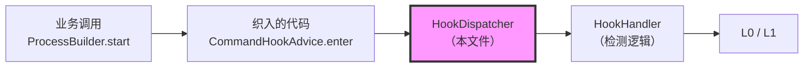

这其实就是一个分发器，织入代码把数据交给它，它再转发给对应的 Handler。

其中一共有两个核心数据结构：`ACTIVE_MASK`和`HANDLERS`。

### ACTIVE_MASK

`ACTIVE_MASK`：这是一个生效集合位图，管理槽位是否启用。

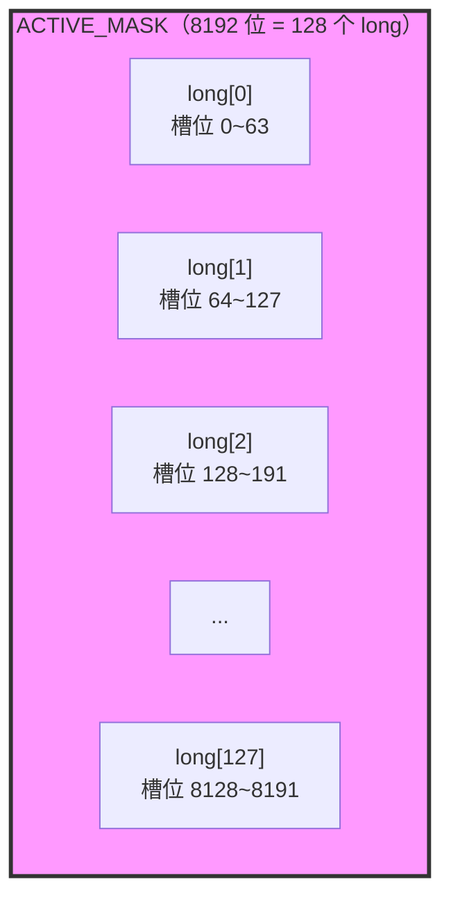

每一个 bit 代表一个槽位是否启用：

- `bit=1`：该 Hook 启用
- `bit=0`：该 Hook 停用

### HANDLERS

`HANDLERS`：槽位到处理逻辑的映射。

这是一个数组，索引是槽位编号，值是处理逻辑：

```text
HANDLERS[0]    → PROCESS_BUILDER_START 的 Handler
HANDLERS[1]    → RUNTIME_EXEC 的 Handler
HANDLERS[2]    → 未注册，NOOP
...
HANDLERS[8191] → 未注册，NOOP
```

初始化的时候我们全部填`NOOP`。这样在进行分发的时候就不需要判空了，未注册的槽位直接调用`NOOP`,什么都不做。

### 方法

**active()**

这个方法是整个 Hook 机制最关键的一行代码，它会被织入到每个 Hook 点的开头：

```java
@Advice.OnMethodEnter
public static void enter(@Advice.This Object self){
    if(HookDispatcher.active(HookSlots.PROCESS_BUILDER_START)){  // ← 这里
        HookDispatcher.enterO(HookSlots.PROCESS_BUILDER_START, self);
    }
}
```

这里用位运算来判断`ACTIVE_MASK`这个`AtomicLongArray`的某个`long[]`的某一位是 0 还是 1。

**setActive()**

这个方法里用到了 CAS，先了解一下 CAS 是啥。

**CAS = Compare-And-Swap（比较并交换）**，这是一种无锁的原子操作。它是 Java 并发编程的基石。（其实这里我也没理解是什么意思。）

CAS 有三个参数：内存地址、期望值、新值。

语义就是：如果**内存地址**的当前值 == 期望值，则把**内存地址**的值改位为新值并返回`true`，否则不做修改并返回`false`。这里的关键就是：**整个比较加交换的流程是一个原子操作，不能分割**。而放到实际场景中，如果两个线程同时启用不同槽位，但是修改的都是`long[0]`的`bit`，如果不使用 CAS 就可能导致一个线程的修改覆盖了另一个线程的修改。

**register()**

这个方法负责注册 Handler + 启用。

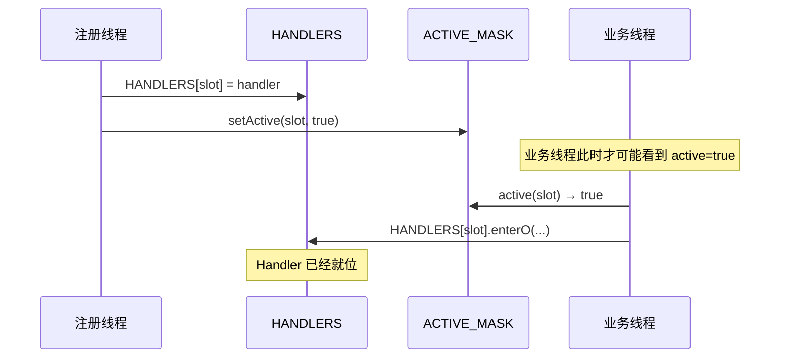

**unregister()**

这个方法负责停用 + 清引用。先清除位图然后再清除引用。

停用和卸载是两码事：

| 操作     | 时机       | 成本                                       |
| :------- | :--------- | :----------------------------------------- |
| **停用** | 运行期     | 纳秒级（清位图）                           |
| **卸载** | 插件退役时 | 分钟级（排水 + 清引用 + 回收 ClassLoader） |

**分发入口**

**每种签名对应一种参数形态：**

| 签名      | 参数                     | 用途                               |
| :-------- | :----------------------- | :--------------------------------- |
| `enterO`  | `(slot, Object)`         | 单对象（如 `ProcessBuilder` 实例） |
| `enterOO` | `(slot, Object, Object)` | 双对象                             |
| `enterS`  | `(slot, String)`         | 单字符串（如 SQL 语句）            |
| `enterSS` | `(slot, String, String)` | 双字符串（如协议 + URL）           |
| `enterII` | `(slot, int, int)`       | 双整数                             |

这几个分发器是为了适配不同的 Hook 点的参数形态而预定义的“签名族”。它们就是为了解决一个核心问题：**不同方法被 Hook 时，需要传给 Handler 的参数不一样，但是分发器不能每次都`new`一个数组**。

看一下一个样例调用链：

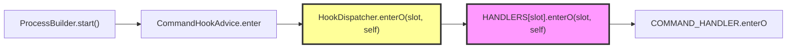

## 总结

看一下我目前的几个类之间的关系：

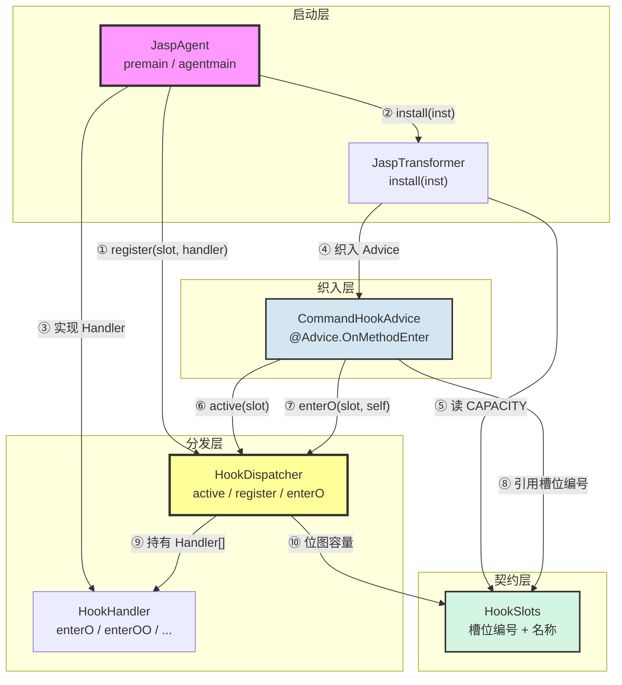

依赖方向：

```text
JaspAgent
  ├── HookDispatcher    （注册 Handler）
  ├── JaspTransformer   （安装转换器）
  └── HookHandler       （实现 Handler）

JaspTransformer
  ├── CommandHookAdvice （织入）
  └── HookSlots         （读容量）

CommandHookAdvice
  ├── HookDispatcher    （active + enterO）
  └── HookSlots         （引用槽位编号）

HookDispatcher
  ├── HookHandler       （持有 Handler[]）
  └── HookSlots         （位图容量）

HookHandler
  └── （无依赖，抽象类）

HookSlots
  └── （无依赖，纯常量）
```

JVM 启动阶段时序图：

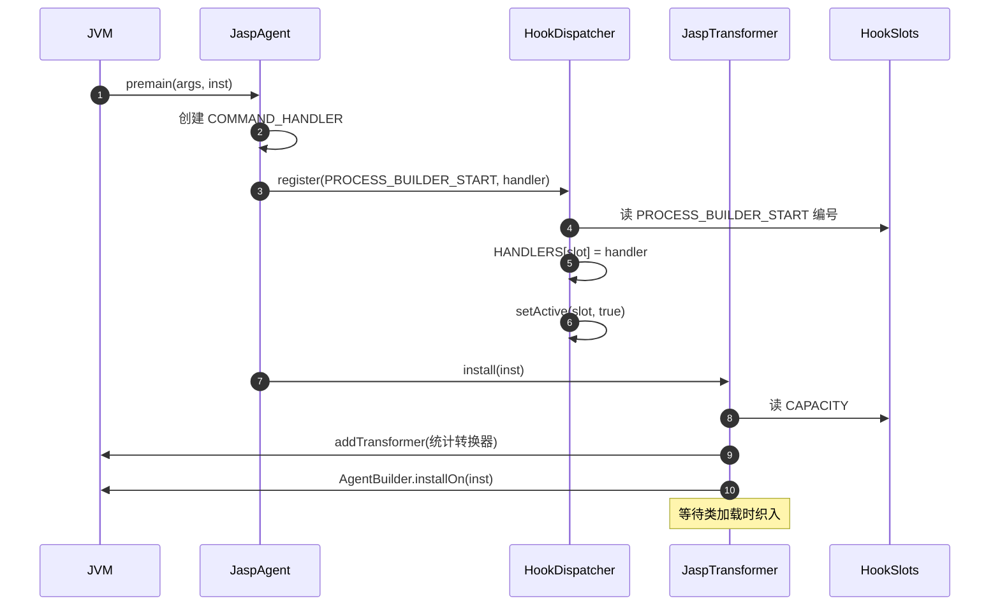

业务阶段时序图：

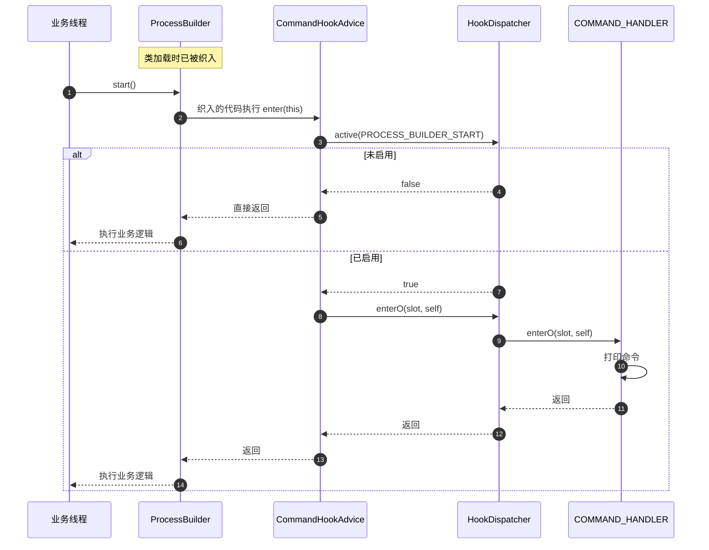

完整数据流图：

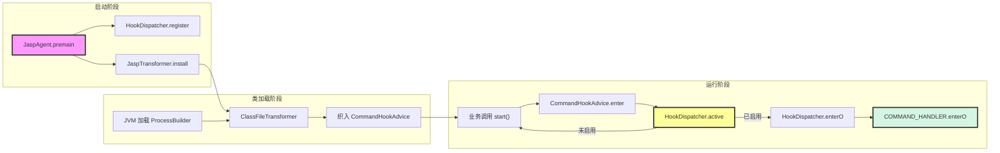

| 文件                  | 角色         | 依赖                                           | 被谁依赖                      |
| :-------------------- | :----------- | :--------------------------------------------- | :---------------------------- |
| **JaspAgent**         | 启动入口     | HookDispatcher / JaspTransformer / HookHandler | JVM                           |
| **JaspTransformer**   | 字节码转换   | CommandHookAdvice / HookSlots                  | JaspAgent                     |
| **CommandHookAdvice** | 织入逻辑     | HookDispatcher / HookSlots                     | JaspTransformer（织入）       |
| **HookDispatcher**    | 分发中心     | HookHandler / HookSlots                        | CommandHookAdvice / JaspAgent |
| **HookHandler**       | 处理逻辑抽象 | 无                                             | HookDispatcher / JaspAgent    |
| **HookSlots**         | 契约常量     | 无                                             | 全部                          |

一句话总结一下：

```text
JaspAgent         启动入口，注册 Handler + 安装转换器
    ↓
JaspTransformer   字节码转换器，把 CommandHookAdvice 织入 ProcessBuilder
    ↓
CommandHookAdvice 织入逻辑，调用 HookDispatcher.active + enterO
    ↓
HookDispatcher    分发中心，管理位图 + Handler[]
    ↓
HookHandler       处理逻辑抽象，COMMAND_HANDLER 是它的实现
    ↓
HookSlots         契约常量，所有组件都引用它

启动时：JaspAgent → HookDispatcher.register → JaspTransformer.install
运行期：ProcessBuilder.start → CommandHookAdvice → HookDispatcher → Handler
```


